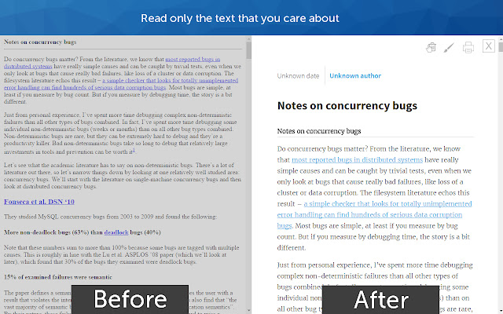

#  Reader Mode

Clear the clutter from webpages including ads, cookie notices, popups



## Downloads
<table cellspacing="0" cellpadding="0">
  <tr style="text-align: center">
    <td valign="center">
      <a align="center" href="https://chrome.google.com/webstore/ifokcmpbomhoaofjkbdhnfldmgiiggof">
        
        <p align="center">Chrome Web Store</p>
      </a>
    </td>
    <td valign="center">
      <a href="https://addons.mozilla.org/firefox/extensions/">
        
        <p align="center">Firefox Add-ons</p>
      </a>
    </td>
        <td valign="center">
      <a href="https://addons.opera.com/en/extensions/">
        
        <p align="center">Opera Add-ons</p>
      </a>
    </td>
        <td valign="center">
      <a href="https://microsoftedge.microsoft.com/addons">
        
        <p align="center">Ms Edge Add-ons</p>
      </a>
    </td>
        <td valign="center">
      <a href="https://apps.apple.com/app/apple-store/">
        
        <p align="center">Safari Extensions</p>
      </a>
    </td>
  </tr>
</table>

## Features

* Disable surrounding webpage noise and clutter with one click, including:
  * Cookie notices
  * Ads
  * Popups
  * Comments
  * And a host of other distracting elements
* Send To Kindle functionality
* Adjust typeface and text size, and toggle between light or dark themes
* Quick keyboard shortcut (Cmd + Esc for Mac users, Alt + ` for Windows users) to switch to Reader on any article page
* Printing optimization
* Sharing through Facebook, Twitter and Email

## Project setup

```bash
# Install dependencies
npm install

# Build extension for development, watch for file changes and rebuild.
node tools/esbuild watch

# Generate compliant images assets for logo (default logo location src/assets/logo.png)
node tools/esbuild generateIcons

# Translate app strings to all supported chrome locales
node tools/esbuild translate

# Start an instance of Chromium with extension installed (using puppeteer)
# For Firefox, pass --browser=firefox as argument.
node tools/esbuild start 

# Build and package extension into a store-ready upload
node tools/esbuild --prod 

# Create extension package for Firefox/Opera/Edge by specifying --browser argument
node tools/esbuild --prod --browser=firefox

# Run tests
node tools/esbuild test
```

### Install Locally

#### Chrome
1. Open chrome and navigate to extensions page using this URL: chrome://extensions.
2. Enable the "Developer mode".
3. Click "Load unpacked extension" button, browse the `build/chrome-dev` directory and select it.

### Firefox
1. Open firefox and navigate to `about:debugging#/runtime/this-firefox`.
2. Click the "Load Temporary Add-on" button.
3. Browse the `build/firefox-dev` directory and select the `manifest.json` file.

<br>
<br>
