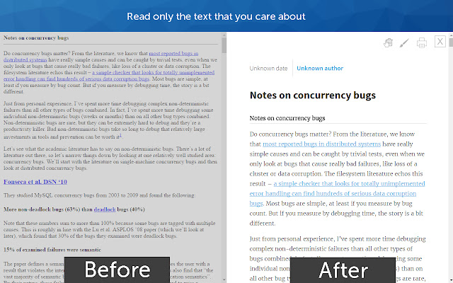

##  Reader Mode

Clear the clutter from webpages including ads, cookie notices, popups

## Downloads
<table cellspacing="0" cellpadding="0">
  <tr style="text-align: center">
    <td valign="center">
      <a align="center" href="https://chrome.google.com/webstore/ifokcmpbomhoaofjkbdhnfldmgiiggof">
        
Chrome Web Store

      </a>
    </td>
    <td valign="center">
      <a href="https://addons.mozilla.org/firefox/extensions/">
        
Firefox Add-ons

      </a>
    </td>
        <td valign="center">
      <a href="https://addons.opera.com/en/extensions/">
        
Opera Add-ons

      </a>
    </td>
        <td valign="center">
      <a href="https://microsoftedge.microsoft.com/addons">
        
Ms Edge Add-ons

      </a>
    </td>
        <td valign="center">
      <a href="https://apps.apple.com/app/apple-store/">
        
Safari Extensions

      </a>
    </td>
  </tr>
</table>

## Features

* Disable surrounding webpage noise and clutter with one click, including:
  * Cookie notices
  * Ads
  * Popups
  * Comments
  * And a host of other distracting elements
* Send To Kindle functionality
* Adjust typeface and text size, and toggle between light or dark themes
* Quick keyboard shortcut (Cmd + Esc for Mac users, Alt + ` for Windows users) to switch to Reader on any article page
* Printing optimization
* Sharing through Facebook, Twitter and Email
